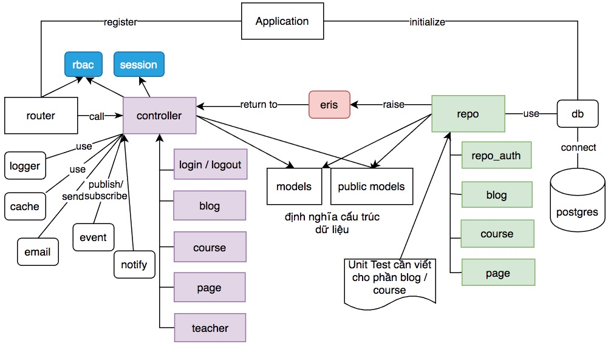

# Một số package hay dùng

[**Hãy đọc kỹ những thay đổi theo phiên bản**](doc/change.md)
### Lộ trình phát triển mới
1. Bổ xung kết nối WebSocket
2. Các hàm bổ trợ cho go-pg
3. Thêm hàm Delete, Put cho resto
4. Thêm hàm dùng chung cho template
5. Thêm chức năng bổ xung REST API để các dịch vụ khác truy vấn lấy thông tin: tên dịch vụ, thời gian kể từ lúc khởi động, danh sách các route + phần quyền...
6. Session cần kéo dài expire date khi người dùng tiếp tục truy cập
7. Bổ xung cách khác để gửi email, gom vào một dịch vụ chuyên biệt để gửi email
8. Chức năng chạy schedule task để dọn dẹp ví dụ dọn thư mục log, xoá bớt orphan entry trong Redis

### Giới thiệu
Module này tổng hợp nhiều package hữu dụng, sử dụng cùng với Iris framework để tạo ra một ứng dụng hoàn chỉnh
1. config: cấu hình, sử dụng [Viper config](https://github.com/spf13/viper)
2. template: chuyên xử lý template engine
3. session: quản lý session, kết nối vào redis. Phụ thuộc vào [iris session](https://github.com/kataras/iris/blob/master/sessions/sessions.go)
4. resto: thư viện rest client hỗ trợ retry, sử dụng [go-retryablehttp](https://github.com/hashicorp/go-retryablehttp)
5. rbac: phân quyền Role Based Access Control
6. pmodel: định nghĩa cấu trúc dữ liệu dùng chung giữa package rbac, session
7. db: kết nối CSDL Postgresql
8. email: gửi email theo nhiều cách khác nhau
9. logger



## 1. Hướng dẫn cài đặt module core
```
go get -u github.com/TechMaster/core@main
```

Chú ý do module core luôn đi cùng với module iris, viper do đó bạn cần bổ xung
```
go get -u github.com/kataras/iris/v12@master
```

#### Chạy thử được luôn ví dụ về module core
Để thử nghiệm nhanh các tính năng của module core bằng cách:
```
git clone https://github.com/TechMaster/core.git
cd core
go mod tidy
```

Khởi động một redis server. Trước đó hãy tạo thư mục data để map volume
```
docker run --name=redis -p 6379:6379 -d -e REDIS_PASSWORD=123 -v $PWD/data:/data redis:alpine3.14 /bin/sh -c 'redis-server --appendonly yes --requirepass ${REDIS_PASSWORD}'
```

Chạy lệnh
```
go run main.go
```

Truy cập địa chỉ http://localhost:9001, login thử với các user khác nhau
## 2. Ví dụ hàm main.go sử dụng module core
```go
package main

import (
	"video/router"

	"github.com/TechMaster/core/config"
	"github.com/TechMaster/core/rbac"
	"github.com/TechMaster/core/session"
	"github.com/TechMaster/core/sessions"
	"github.com/TechMaster/core/template"
	"github.com/TechMaster/core/logger"
	"github.com/kataras/iris/v12"
	"github.com/spf13/viper"
)

func main() {
	app := iris.New()
	config.ReadConfig()

	logFile := logger.Init() //Cần phải có 2 file error.html và info.html ở /views
	if logFile != nil {
		defer logFile.Close()
	}

	redisDb := session.InitRedisSession()
	defer redisDb.Close()
	app.Use(session.Sess.Handler())

	rbacConfig := rbac.NewConfig()
	rbacConfig.MakeUnassignedRoutePublic = true //mọi route không dùng rbac coi là public
	rbac.Init(rbacConfig) //Khởi động với cấu hình mặc định

	//đặt hàm này trên các hàm đăng ký route - controller
	app.Use(rbac.CheckRoutePermission)

	app.HandleDir("/", iris.Dir("./static"))  //phục vụ thư mục file tĩnh

	router.RegisterRoute(app)  //Cấu hình đường dẫn đến các controller

	template.InitViewEngine(app) //Khởi tạo View Template Engine

	//Luôn để hàm này sau tất cả lệnh cấu hình đường dẫn với RBAC
	rbac.BuildPublicRoute(app)
	//rbac.DebugRouteRole()
	_ = app.Listen(viper.GetString("port"))
}
```

## 3. Sử dụng config

Cần đảm bảo phải có 2 file `config.dev.json` và `config.product.json` ở thư mục gốc của dự án
```
.
├── config.dev.json
├── config.product.json
```

Để đọc giá trị cấu hình dùng lệnh `viper.GetString("key")` hoặc `viper.GetInt("key")`
```go
_ = app.Listen(viper.GetString("port"))
```

Tham khảo file cấu hình [config.dev.json](config.dev.json)

package config có hàm này để cho biết ứng dụng đang chạy mode Debug hay Production từ đó nạp file cấu hình cho phù hợp
```go
/*
Trả về true nếu ứng dụng đang chạy ở chế độ Debug và ngược lại
*/
func IsAppInDebugMode() bool {
	appCommand := os.Args[0]
	if strings.Contains(appCommand, "debug") || strings.Contains(appCommand, "exe") {
		return true
	}
	return false
}
```
## 4. Logger
Trước đây logger phát hành thành một module riêng [https://github.com/techmaster/logger](https://github.com/techmaster/logger), nay chuyển logger vào đây thành một package cho dễ quản lý

```go
logFile := logger.Init() //Cần phải có 2 file error.html và info.html ở /views
if logFile != nil {
	defer logFile.Close()
}
```
## 5. Sử dụng Session
### 5.1 Chạy ứng dụng đơn lẻ độc lập
Nếu bạn viết ứng dụng đơn lẻ thì có thể lưu trực tiếp session vào vùng nhớ của ứng dụng web. Khi này bạn không cần dùng Redis hay bất kỳ CSDL.

Hàm khởi tạo Session trong file main.go sẽ như sau
```go
app.Use(session.Sess.Handler())
```
### 5.2 Nhiều ứng dụng dùng chung session database
Khi có nhiều ứng dụng web, microservice dùng chung một domain nhưng định địa chỉ bằng các sub domain khác nhau, để có được chức năng Single Sign On (đăng nhập một lần, nhưng truy cập được nhiều site cùng chung domain), chúng ta buộc phải lưu session ra database chung ví dụ như Redis.

```go
redisDb := session.InitRedisSession()
defer redisDb.Close()
app.Use(session.Sess.Handler())
```
### 5.3 Làm thế nào để biết người dùng đã đăng nhập?
package session cung cấp 2 hàm

```go
func GetAuthInfo(ctx iris.Context) (authinfo *pmodel.AuthenInfo)
func GetAuthInfoSession(ctx iris.Context) (authinfo *pmodel.AuthenInfo)
```
`GetAuthInfo` đầu tiên sẽ lấy thông tin đăng nhập của người dùng từ `ViewData["authinfo"]` nếu không thấy sẽ tiếp tục gọi vào `GetAuthInfoSession` để lấy thông tin từ session.

Nếu trả về `nil` có nghĩa người dùng chưa đăng nhập. Nếu khác `nil` thì cấu trúc dữ liệu trả về như sau:
```go
type AuthenInfo struct {
	Id       string //unique id của user
	FullName string //họ và tên đầy đủ của user
	Email    string //email cũng phải unique
	Avatar   string //unique id hoặc tên file ảnh đại diện
	Roles    Roles  //kiểu map[int]bool. Cần phải chuyển đổi Roles []int32 `pg:",array"` sang
}
```

Tôi đã bỏ hàm `func IsLogin(ctx iris.Context)` vì hàm này không trả về đầy đủ được thông tin. Ngược lại hàm `func GetAuthInfo` trả về được id, full name, email, avatar và danh sách roles của người dùng.

Bạn cần lấy danh sách roles của người dùng mảng các chuỗi mô tả role. Hãy truyền `authinfo.Roles` vào hàm này
```go
rbac.RolesNames(roles pmodel.Roles)[]string
```
Bạn cần in ra danh sách role vừa có giá trị int và có chuỗi mô tả để debug cho thuận tiện `3:trainer, 8:maintainer`. Hãy tham khảo hàm [func GetAll](repo/repo.go)
```go
rolesString := ""
for i, role := range user.Roles {
	rolesString += fmt.Sprintf("%d:%s", role, rbac.RoleName(role))
	if i < len(user.Roles)-1 {
		rolesString += ", "
	}
}
```

Bạn có một mảng ```[]int``` thể hiện các role, cần chuyển sang kiểu `type Roles map[int]interface{}`. Hãy dùng [IntArrToRoles](pmodel/role.go)
```go
func IntArrToRoles(intArr []int) Roles 
```
### 5.4 Khi logout bắt buộc phải dùng hàm session.Logout
Hàm này thực hiện việc xoá session id và phần tử session trong tập user.Id. Nó có tác dụng loại bỏ bớt rác trong redis database.
```go
func Logout(ctx iris.Context) error
```

### 5.5 Chức năng cập nhật role chỉ dành cho Admin
Khi Admin thay đổi role người dùng. Người này không cần logout mà role có tác dụng ngay, trên mọi thiết bị anh ta đang đăng nhập.

```go
func UpdateRole(userID string, roles []int) error
```

Xem chi tiết [controller/changerole.go](controller/changerole.go) và [session/update_role.go](session/update_role.go)

Để thực hiện được tính năng này phải lưu quan hệ một user.Id chứa một tập các Session.id. Khi cập nhật Roles cho một user.Id chúng ta nhanh chóng tìm được tất cả các Session của user đó để cập nhật. Ngoài ra phải đặt Expire time để xoá bản ghi này.

Nếu vì một nguyên nhân nào đó, thuật toán đồng bộ Role của user trên mọi thiết bị bị lỗi. User có thể logout rồi login lại.
Thuật toán này chưa hoàn hảo, nó có thể để lại rác trong Redis trong một số trường hợp.

Hiện nay tôi copy toàn bộ package https://github.com/kataras/iris/tree/master/sessions vào thư mục sessions. Hiện chưa sửa đổi gì. Tuy nhiên sẽ fix bug ngay nếu package này có lỗi.
### 5.6 Chức năng Logout
Trong framework Iris, khi người dùng logout ở một trình duyệt trên một thiết bị, không làm sao xoá được key = sessionID. Hàm này không những xoá key = sessionID mà còn sửa lại entry UserID bỏ bớt phần tử sessionID
```go
func Logout(ctx iris.Context) error
```

## 6. Sử dụng RBAC
Cần khởi tạo và cấu hình RBAC trong file main.go
Sau đó trong router viết hàm đăng ký route + controller

RBAC hỗ trợ 4 hàm:
1. `Allow(rbac.RoleX, rbac.RoleY)`: cho phép RoleX và RoleY
2. `AllowAll()`: cho phép tất cả các role
3. `Forbid(rbac.RoleA, rbac.RoleB)`: cấm role RoleA, RoleB, các role khác đều được phép
4. `ForbidAll()`: cấm tất cả các role

Có thể chuyển app và hoặc đối tượng party vào tham số đầu tiên của rbac

```go
func RegisterRoute(app *iris.Application) {

	app.Get("/", controller.ShowHomePage) //Không dùng rbac có nghĩa là public method
	app.Post("/login", controller.Login)
	rbac.Get(app, "/logout", rbac.AllowAll(), controller.LogoutFromWeb)

	blog := app.Party("/blog")
	{
		blog.Get("/", controller.GetAllPosts) //Không dùng rbac có nghĩa là public method
		rbac.Get(blog, "/all", rbac.AllowAll(), controller.GetAllPosts)
		rbac.Get(blog, "/create", rbac.Forbid(rbac.MAINTAINER), controller.GetAllPosts)
		rbac.Get(blog, "/{id:int}", rbac.Allow(rbac.AUTHOR, rbac.EDITOR), controller.GetPostByID)
		rbac.Get(blog, "/delete/{id:int}", rbac.Allow(rbac.ADMIN, rbac.AUTHOR, rbac.EDITOR), controller.DeletePostByID)
		rbac.Any(blog, "/any", rbac.Allow(rbac.MAINTAINER), controller.PostMiddleware)
	}

	student := app.Party("/student")
	{
		rbac.Get(student, "/submithomework", rbac.Allow(rbac.STUDENT), controller.SubmitHomework)
	}

	trainer := app.Party("/trainer")
	{
		rbac.Get(trainer, "/createlesson", rbac.Allow(rbac.TRAINER), controller.CreateLesson)
	}

	sysop := app.Party("/sysop")
	{
		rbac.Get(sysop, "/backupdb", rbac.Allow(rbac.SYSOP), controller.BackupDB)
		rbac.Get(sysop, "/upload", rbac.Allow(rbac.MAINTAINER, rbac.SYSOP), controller.ShowUploadForm)
		rbac.Post(sysop, "/upload", rbac.Allow(rbac.MAINTAINER, rbac.SYSOP, rbac.SALE), iris.LimitRequestBodySize(300000), controller.UploadPhoto)
	}
}
```
Mặc định đã có sẵn các role sau đây

```go
const (
	ADMIN      = 1
	STUDENT    = 2
	TRAINER    = 3
	SALE       = 4
	EMPLOYER   = 5
	AUTHOR     = 6
	EDITOR     = 7 //edit bài, soạn page, làm công việc digital marketing
	MAINTAINER = 8 //quản trị hệ thống, gánh bớt việc cho Admin, back up dữ liệu. Sửa đổi profile,role user, ngoại trừ role ROOT và Admin
)
```
## 7. Cấu trúc dữ liệu trong pmodel

pmodel là nơi định nghĩa cấu trúc dữ liệu phụ vụ việc đăng nhập, quản lý người dùng

Cấu trúc chi tiết User xem ở đây [pmodel/user.go](pmodel/user.go)

Danh sách các Role cấp cho một user
```go
type Roles map[int]interface{}
```
Struct sẽ lưu trong session để hệ thống quản lý phiên đăng nhập của người dùng
```go
type AuthenInfo struct {
	Id       string //unique id của user
	FullName string //họ và tên đầy đủ của user
	Email    string //email cũng phải unique
	Avatar   string //unique id hoặc tên file ảnh đại diện
	Roles    Roles  //kiểu map[int]bool. Cần phải chuyển đổi Roles []int32 `pg:",array"` sang
}
```

Chú ý kiểu `map[int]bool` khi lưu vào Redis sẽ biến thành `map[string]bool`
Chuyển đổi Roles kiểu map[int] bool sang mảng []int để lưu xuống CSDL
```go
func RolesToIntArr(roles Roles) []int
```

Chuyển đổi kiểu intArray trong đó mỗi phần tử ứng với một role, sang kiểu map[int] bool
```go
func IntArrToRoles(intArr []int) Roles
```

## 8. Template Engine
Hiện chưa viết được nhiều hàm phụ trợ. Sau sẽ bổ xung thêm.
Chủ yếu sử dụng Blocks template của iris. Nếu thư viện này có lỗi sẽ clone và tạo thư viện mới.
Chú ý để dùng được `*view.BlocksEngine` bạn phải lấy bản mới nhất thư viện Iris
```
go get -u github.com/kataras/iris/v12@master
```
[template/base.go](template/base.go)
```go
package template

import (
	"github.com/kataras/iris/v12"
	"github.com/kataras/iris/v12/view"
)

var ViewEngine *view.BlocksEngine

func InitViewEngine(app *iris.Application) {
	ViewEngine = iris.Blocks("./views", ".html")
	app.RegisterView(ViewEngine)
}
```
## 9. Resto thư viện REST client dựa trên cơ chế retry
```go
response, err := resto.Retry(numberOfTimesToTry, numberOfMilliSecondsToWait).Post(url, jsondata)
response, err := resto.Retry(numberOfTimesToTry, numberOfMilliSecondsToWait).Get(url)
```

Ví dụ chi tiết
```go
response, err := resto.Retry(5, 1000).Post("http://auth/api/login", loginReq)
if err != nil {
  logger.Log(ctx, eris.NewFromMsg(err, "Lỗi khi gọi Auth service").InternalServerError())
  return
}
if response.StatusCode != iris.StatusOK {
  var res struct {
    Error string `json:"error"`
  }
  _ = json.NewDecoder(response.Body).Decode(&res)
  logger.Log(ctx, eris.Warning(res.Error).UnAuthorized())
  return
}
```

## 10. db kết nối CSDL Postgresql
```go
db.ConnectPostgresqlDB(config.Config) //Kết nối vào  CSDL
defer db.DB.Close()
```

Cấu hình kết nối CSDL để ở trong file `config.dev.json` và `config.product.json`
```json
{
	"database": {
			"user": "postgres",
			"password": "123",
			"database": "iris",
			"address": "localhost:5432"
	},
}
```

## 11. email

Đầu tiên là interface gửi email trong [mail_sender.go](email/mail_sender.go)
```go
type MailSender interface {
	SendPlainEmail(to []string, subject string, body string) error
	SendHTMLEmail(to []string, subject string, tmplFile string, data map[string]interface{}) error
}
```

[gmail_smtp.go](email/gmail_smtp.go) gửi email sử dụng một tài khoản Gmail phải bật chế độ không an toàn mới gửi được. Còn cấu hình bằng OAuth2 Gmail Service thì quá khó. Tôi bó tay.

[fake_gmail.go](email/fake_gmail.go) cũng gửi đi từ một tài khoản Gmail, nhưng địa chỉ thư nhận luôn là một hòm thư cấu hình sẵn `test_receive_email string` dùng để kiểm tra, debug ứng dụng.
```go
func InitFakeGmail(config *SMTPConfig, test_receive_email string)
```

[email_db.go](email/email_db.go) thay vì gửi email thì tạo một records trong bảng `debug.emailstore` CSDL Postgresql. Cấu trúc bảng như dưới.

```go
type EmailStore struct {
	tableName  struct{} `pg:"debug.emailstore"`
	Id         int      `pg:",pk"`
	Receipient string
	Subject    string
	Body       string
	CreatedAt  time.Time
}
```
Trong tương lai tôi sẽ bổ xung thêm vài biến thể gửi mail tuân thủ `type MailSender interface`

## 12. pass các hàm băm password
Tuyệt đối không được lưu secret key hay các chuỗi nhạy cảm vào đây. Xem chi tiết [pass/password.go](pass/password.go)

Băm password bằng thư viện Bcrypt
```go
func HashBcryptPass(password string) (string, error) {
	bytes, err := bcrypt.GenerateFromPassword([]byte(password), 14)
	return string(bytes), err
}
```

Kiểm tra password
```go
/*
Hàm check password hỗ trợ cả kiểu SHA1 cũ và bcrypt mới
- inputpass: password nhập vào lúc login
- hashedpass: password đã băm đọc từ CSDL
- salt: chuỗi nhiễu tạo ra từ thuật toán SHA1 cũ
*/
func CheckPassword(inputpass string, hashedpass string, salt string) bool {
	if salt != "" {
		pass := p.NewPassword(sha1.New, 50, 64, 10000)
		return pass.VerifyPassword(inputpass, hashedpass, hashedpass)
	} else {
		err := bcrypt.CompareHashAndPassword([]byte(hashedpass), []byte(inputpass))
		return err == nil
	}
}
```


## Để phát hành phiên bản mới module này cần làm những bước sau
Thay v0.1.3 bằng phiên bản thực tế
```
git add .
git commit -m "v0.1.10"
git tag v0.1.10
git push origin v0.1.10
GOPROXY=proxy.golang.org go list -m github.com/TechMaster/core@v0.1.10
```
