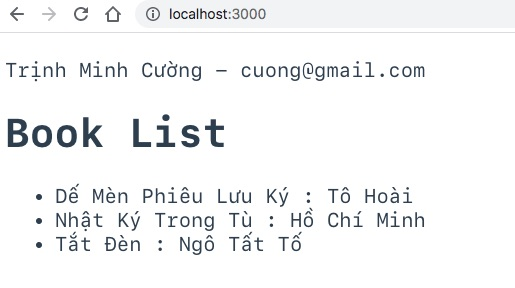

# Chạy ứng dụng Vue3 nối vào REST API do Golang app phục vụ

Dịch vụ REST Golang lắng nghe ở cổng 9001
Còn ứng dụng BookVue lắng nghe ở cổng 3000

Ứng dụng Golang cung cấp api http://localhost:9001/api/books
yêu cầu role STUDENT hoặc TRAINER, cấu trúc dữ liệu trả về như saus
```json
{
  "authinfo": {
    "Id": "1xYyQN7emfIEBGzXVrrC6nfOhVA",
    "FullName": "Trịnh Minh Cường",
    "Email": "cuong@gmail.com",
    "Avatar": "",
    "Roles": {
      "1": true,
      "3": true
    }
  },
  "books": [
    {
      "title": "Dế Mèn Phiêu Lưu Ký",
      "author": "Tô Hoài"
    },
    {
      "title": "Nhật Ký Trong Tù",
      "author": "Hồ Chí Minh"
    },
    {
      "title": "Tắt Đèn",
      "author": "Ngô Tất Tố"
    }
  ]
}
```

Cài đặt Node.js trên máy tính của bạn
Sau đó mở command line gõ lệnh
```
$ cd bookvue
$ yarn install
$ yarn run dev
```

Khi đăng nhập với Role STUDENT hoặc TRAINER ở http://localhost:9001 thì khi vào http://localhost:3000 sẽ thấy



